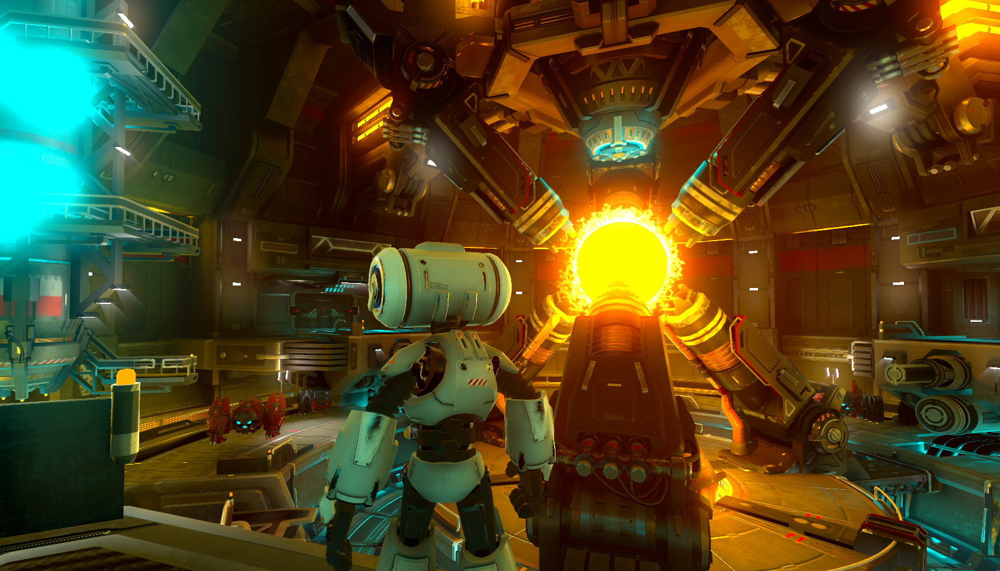

# Third Person Shooter Demo

Third person shooter demo made using [Godot Engine](https://godotengine.org).

Check out this demo on the asset library: https://godotengine.org/asset-library/asset/678

## Godot versions

- The [`master`](https://github.com/godotengine/tps-demo) branch is compatible with the latest stable Godot version (currently 4.x).
- If you are using an older version of Godot, use the appropriate branch for your Godot version:

  - [`3.x`](https://github.com/godotengine/tps-demo/tree/3.x) branch
  for Godot 3.4.x and 3.5.x.
  - [`3.3`](https://github.com/godotengine/tps-demo/tree/3.3) branch
  for Godot 3.3.x.
  - [`3.2`](https://github.com/godotengine/tps-demo/tree/3.2) branch
  for Godot 3.2.2 or 3.2.3.
  - [`3.2.1`](https://github.com/godotengine/tps-demo/tree/3.2.1) branch
  for Godot 3.2.0 or 3.2.1.
  - [`3.1`](https://github.com/godotengine/tps-demo/tree/3.1) branch
  for Godot 3.1.x.

> **Note**
>
> The repository is big, so expect a high wait time when opening the project for
> the first time.

## Git LFS

Git LFS is no longer required for the current `master` or `3.x` branches.

You only need Git LFS if you are checking out the `3.1` or `3.2.1` branches.
Those branches have instructions for Git LFS in their README files.

## Running

You need [Godot Engine](https://godotengine.org) to run this demo project.
Download the latest stable version [from the website](https://godotengine.org/download/),
or [build it from source](https://github.com/godotengine/godot).

You can either download from the Godot Asset Library, clone this repository, or
[download a ZIP archive](https://github.com/godotengine/tps-demo/archive/master.zip).

## Controls

- Mouse or <kbd>Gamepad Right Stick</kbd>: Look around
- <kbd>W</kbd>/<kbd>A</kbd>/<kbd>S</kbd>/<kbd>D</kbd>, <kbd>Arrow keys</kbd>, <kbd>Gamepad Left Analog Stick</kbd> or <kbd>Gamepad D-Pad</kbd>: Move
- <kbd>Space</kbd>, <kbd>Gamepad A/Cross</kbd>: Jump
- <kbd>Right Mouse Button</kbd>, <kbd>Gamepad Left Trigger (L2)</kbd> (press to toggle, or hold and release): Aim
- <kbd>Left Mouse Button</kbd>, <kbd>Gamepad Right Trigger (R2)</kbd>: Shoot (only while aiming)
- <kbd>Escape</kbd>, <kbd>Gamepad Start</kbd>: Go to main menu/quit
- <kbd>F11</kbd> or <kbd>Alt + Enter</kbd>: Toggle fullscreen
- <kbd>F3</kbd>: Toggle debugging information (such as FPS counter)

## Useful links

- [Main website](https://godotengine.org)
- [Source code](https://github.com/godotengine/godot)
- [Documentation](http://docs.godotengine.org)
- [Community hub](https://godotengine.org/community)
- [Other demos](https://github.com/godotengine/godot-demo-projects)

## License

See [LICENSE.md](LICENSE.md) for details.
